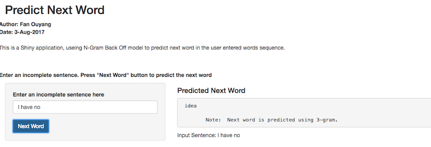

Coursera Data Science Capstone: Predict Next Word App
========================================================
author: Fan Ouyang
date: Aug-3-2017
autosize: true

Introduction
========================================================

- This Shiny application uses N-Gram Back Off model to predict the next word for an incomplete sentence an user entered at the end of the device. 

- All text data that is used to create N-Gram dataset for predictions comes from a corpus called HC Corpora.

- The application is the capstone project for the Coursera Data Science specialization held by Johns Hopkins University and this project is in cooperation with SwiftKey. 

Description of the predictive model
========================================================
- created N-gram dataset from twitter, news and blogs data, which belongs to a corpus called HC Corpora. 

- six N-gram dataset includes uni-gram, bi-gram,tri-gram, quad-gram, penta-gram, hexa-gram data, recording cumulative frequencies of 1-word, 2-word, 3-word, 4-word, 5-word, and 6-word phrases in descending frequency. 

- apply a simple Katz's Back-off algorithm to predict the next word based on N-gram dataset; that is, depending on the phrase the user enters, we first predict the next word with hexa-gram data, if no hexa-gram is found, we back off to penta-gram, then to quad-gram, tri-gram, and bi-gram

Use of the app
========================================================
While entering the text (1), the field with the predicted next word (2) refreshes instantaneously and also the whole text input (3) gets displayed.

Additional Information
========================================================
- The next word prediction app is hosted on shinyapps.io: https://fanouyang.shinyapps.io/predictionnextword/

-- Check out my github rep for more info:
https://github.com/fanouyang/predictnextword

- Learn more about the Coursera Data Science Specialization: 
https://www.coursera.org/specializations/jhu-data-science
